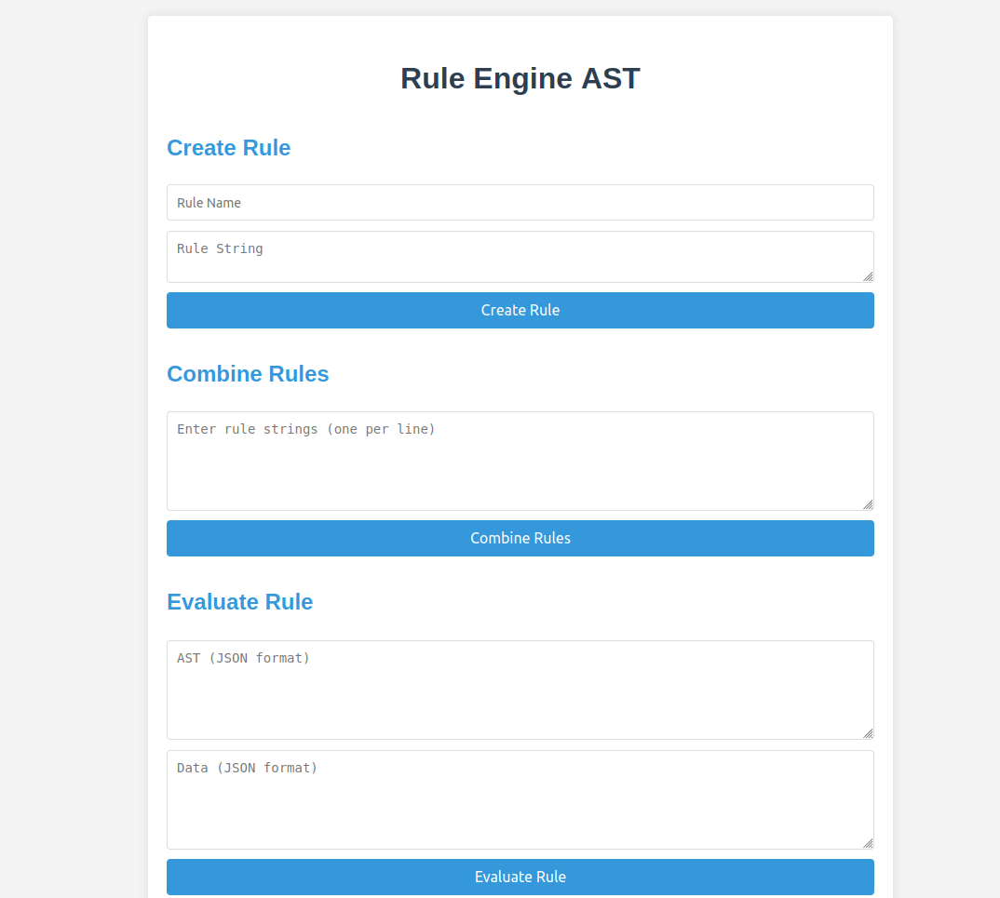
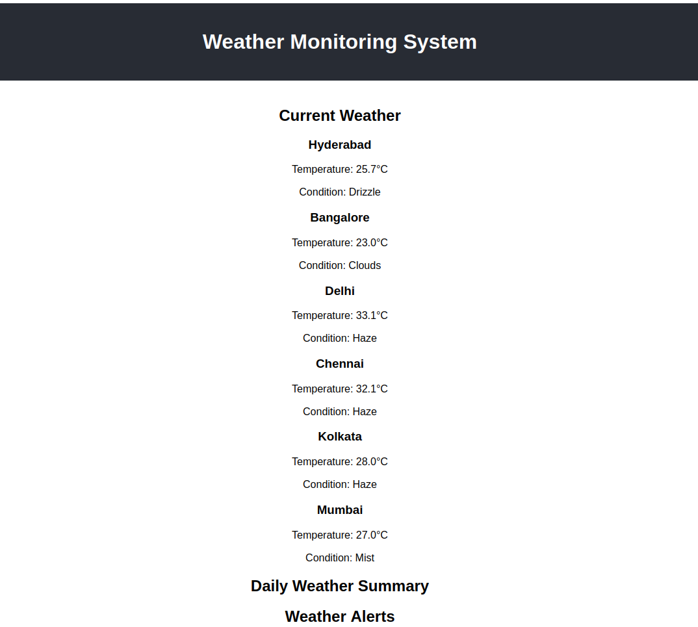

# Rule Engine AST Guide

A simple 3-tier rule engine application using Abstract Syntax Tree (AST) to determine user eligibility based on attributes like age, department, income, and spend.

## Table of Contents

1. [Overview](#overview)
2. [Features](#features)
3. [Technology Stack](#technology-stack)
4. [Prerequisites](#prerequisites)
5. [Installation](#installation)
6. [Running the Application](#running-the-application)
7. [API Endpoints](#api-endpoints)
8. [Design Choices](#design-choices)
9. [Project Structure](#project-structure)

## Overview

This application provides a rule engine that uses Abstract Syntax Trees (AST) to represent conditional rules. It allows for dynamic creation, combination, and modification of these rules, as well as evaluation of data against the rules.

## Features

- Create rules using a string representation
- Combine multiple rules into a single AST
- Evaluate data against rules
- Simple UI for interacting with the rule engine

## Technology Stack

- Frontend: React.js
- Backend: Node.js with Express.js
- Database: MongoDB
- State Management: React Hooks

## Prerequisites

Before you begin, ensure you have met the following requirements:

- Node.js (v14.0.0 or later)
- npm (v6.0.0 or later)
- MongoDB (v4.0 or later)

## Installation

1. Clone the repository:

2. Install server dependencies:
   cd backend npm install

3. Install client dependencies:
   cd ../frontend npm install

## Running the Application

1. Start the MongoDB service on your machine.

2. Start the server:
   cd server npm start
   The server will run on `http://localhost:5000`.

3. In a new terminal, start the client:
   cd client npm start

The client will run on `http://localhost:3000`.

4. Open your browser and navigate to `http://localhost:3000` to use the application.

## API Endpoints

- POST `/api/create-rule`: Create a new rule
- POST `/api/combine-rules`: Combine multiple rules
- POST `/api/evaluate-rule`: Evaluate data against a rule

For detailed API documentation, refer to the [API Documentation](API_DOCUMENTATION.md) file.

## Design Choices

1. **MERN Stack**: We chose the MERN (MongoDB, Express.js, React.js, Node.js) stack for its flexibility, scalability, and the ability to use JavaScript throughout the stack.

2. **Abstract Syntax Tree (AST)**: ASTs are used to represent rules because they provide a flexible and powerful way to structure and evaluate complex logical expressions.

3. **Modular Architecture**: The backend is structured with separate routes, models, and utility functions for better organization and maintainability.

4. **React Hooks**: We use React Hooks for state management in the frontend, providing a clean and efficient way to handle component state and side effects.

5. **RESTful API**: The backend exposes a RESTful API, making it easy to interact with the rule engine from various clients.

6. **MongoDB**: MongoDB was chosen as the database for its flexibility in storing complex data structures like ASTs.

7. **Error Handling**: Comprehensive error handling is implemented both in the frontend and backend to provide clear feedback to users and developers.

8. **Minimal UI Design**: The frontend uses a clean, minimal design to focus on functionality while maintaining good user experience.

## Project Structure

rule-engine-ast/ ├── frontend/ │ ├── public/ │ ├── src/ │ │ ├── components/ │ │ ├── App.js │ │ ├── App.css │ │ └── index.js │ └── package.json ├── backend/ │ ├── models/ │ ├── routes/ │ ├── utils/ │ ├── config.js │ ├── server.js │ └── package.json └── README.md

# Real-Time Data Processing System for Weather Monitoring

This project is a real-time data processing system that monitors weather conditions and provides summarized insights using rollups and aggregates. It utilizes data from the OpenWeatherMap API.

## Features

- Continuous retrieval of weather data for major Indian metros
- Daily weather summaries with aggregates
- Alerting system for temperature thresholds
- Visualizations for daily weather summaries and historical trends

## Prerequisites

Before you begin, ensure you have met the following requirements:

- Node.js (v14.0.0 or later)
- npm (v6.0.0 or later)
- MongoDB (v4.0 or later)
- OpenWeatherMap API key

## Installation

1. Clone the repository:

2. Install server dependencies:

3. Install client dependencies:

4. Create a `.env` file in the server directory with the following content:

## Running the Application

1. Start the MongoDB service on your machine.

2. Start the server:
   cd server npm start

3. In a new terminal, start the client:
   cd client npm start

4. Open your browser and navigate to `http://localhost:3000` to use the application.

## Design Choices

1. **MERN Stack**: We chose the MERN (MongoDB, Express.js, React.js, Node.js) stack for its flexibility and JavaScript ecosystem.

2. **Real-time Updates**: The system fetches weather data at configurable intervals to provide near real-time updates.

3. **Daily Summaries**: We generate daily summaries to provide aggregated insights, which are useful for trend analysis.

4. **Alerting System**: The alerting system is designed to be configurable and can be easily extended to include more complex conditions.

5. **Visualization**: We use Chart.js for creating visual representations of the weather data, making it easier for users to understand trends.

6. **Modular Architecture**: The project is structured with separate components and services for better organization and maintainability.

## API Endpoints

- GET `/api/current-weather`: Retrieves the current weather data for all cities
- GET `/api/daily-summary`: Retrieves the daily weather summaries
- GET `/api/alerts`: Retrieves any active weather alerts
